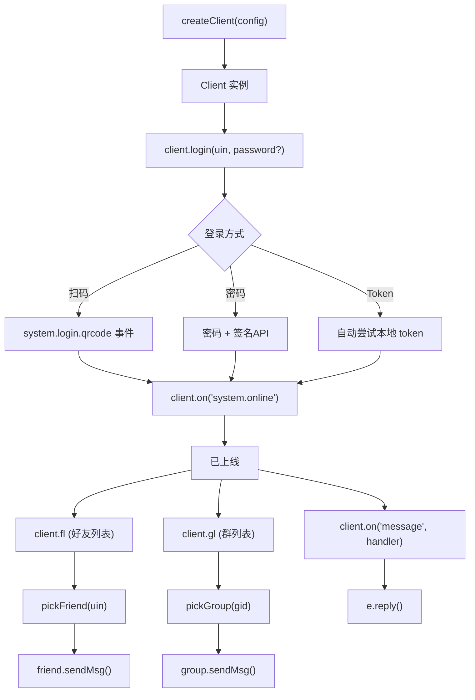
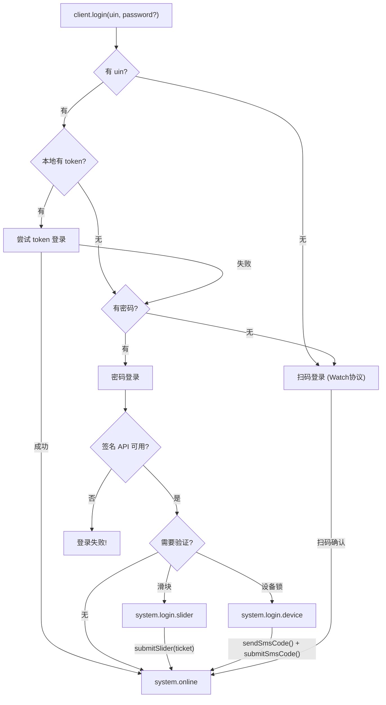
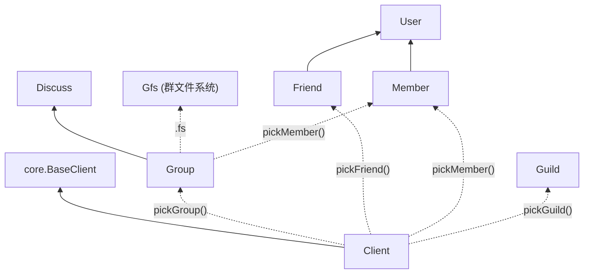

# ICQQ 深度解析：QQ 协议的 Node.js 实现

> **作者**：叫我小杨同学的小码酱
> **标签**：`QQ协议` `Node.js` `Bot开发` `即时通讯` `逆向工程`
> **更新**：2026-02-16

---

## 模块 0：核心摘要 (TL;DR)

**一句话**：ICQQ 是一个用 Node.js 实现的 QQ 安卓客户端协议库——它不是聊天软件，而是一台"QQ 翻译机"，让你的代码能像真人一样收发 QQ 消息。

**认知挂钩**：想象你在国外打电话，ICQQ 就是那个同声传译器——QQ 服务器说的是"协议语言"，你的 JavaScript 代码说的是"程序语言"，ICQQ 在中间实时翻译。

**真理锚点**：
> *"本项目为协议实现，不推荐直接使用。"* —— icqq README

这句话至关重要：ICQQ 是**底层协议库**，不是框架。就像发动机不是汽车——你需要 Miao-Yunzai、Zhin 等框架来包装它。

---

## 模块 1：概念破冰

### 🧠 巧记卡片

```
╔══════════════════════════════════════════╗
║  ICQQ 五字诀：                            ║
║                                          ║
║  「创」createClient 建连接               ║
║  「登」login 扫码/密码入                 ║
║  「听」on('message') 接消息              ║
║  「发」sendMsg / reply 回消息            ║
║  「拣」pickFriend / pickGroup 选目标     ║
║                                          ║
║  记住：创-登-听-发-拣，五步走天下！      ║
╚══════════════════════════════════════════╝
```

### 故事引入：一封被拦截的信

2022 年的某个深夜，takayama-lily 决定归档她的 OICQ 项目——这个让无数开发者能用 Node.js 控制 QQ 的传奇库。社区陷入恐慌："我们的机器人怎么办？"

就在这时，icqqjs 团队 fork 了 OICQ 的代码，像一群接力赛跑者那样接过了火炬。他们不仅修复了登录协议，还加入了**频道支持**、**QQNT 协议**和**群精华消息**——ICQQ 由此诞生。

到 2026 年的今天，ICQQ 已经成为 Miao-Yunzai（云崽）生态的核心引擎，驱动着成千上万的 QQ 群机器人。

### 可视化：ICQQ 在生态中的位置

```
                    ┌─────────────────────┐
                    │    你的 Bot 代码      │
                    └─────────┬───────────┘
                              │
                    ┌─────────▼───────────┐
                    │  框架层 (Yunzai等)    │
                    │  路由/插件/生命周期    │
                    └─────────┬───────────┘
                              │
              ╔═══════════════▼═══════════════╗
              ║       ICQQ 协议库              ║
              ║  ┌───────┐ ┌───────┐ ┌──────┐ ║
              ║  │Client │ │Group  │ │Friend│ ║
              ║  │Message│ │Member │ │Guild │ ║
              ║  └───────┘ └───────┘ └──────┘ ║
              ╚═══════════════╤═══════════════╝
                              │ TCP/TLS
                    ┌─────────▼───────────┐
                    │   签名服务器 (sign)   │
                    └─────────┬───────────┘
                              │
                    ┌─────────▼───────────┐
                    │   QQ 服务器集群       │
                    └─────────────────────┘
```

---

## 模块 2：深度解析

### 2.1 前世今生：从 OICQ 到 ICQQ

| 时间线 | 事件 | 意义 |
|--------|------|------|
| 2020 | takayama-lily 创建 OICQ | 第一个成熟的 Node.js QQ 协议库 |
| 2022 | OICQ v2 发布 | 重构 API，引入 `pick*` 模式 |
| 2023-11 | OICQ 归档 (read-only) | 原作者停止维护 |
| 2023+ | icqqjs 团队 fork → ICQQ | 添加频道、QQNT、精华消息等 |
| 2025 | 包名迁移至 `@icqqjs/icqq` | GitHub Packages 发布 |
| 2026 | 持续维护，支持 NTLogin | 适配腾讯最新协议变更 |

**关键转变**：`createClient` 不再传入 QQ 号，改为在 `login()` 时传入——这个看似微小的 API 变更，实际上反映了"一个客户端可以切换账号"的架构进化。

### 2.2 核心架构：Client 为王

ICQQ 的整个 API 设计围绕一个核心思想：**万物皆从 Client 出发**。



### 2.3 六大数据容器

Client 登录成功后，会自动填充以下核心数据结构：

| 属性 | 类型 | 说明 | 使用场景 |
|------|------|------|----------|
| `client.fl` | `Map<number, FriendInfo>` | 好友列表 | 遍历好友、查找好友信息 |
| `client.gl` | `Map<number, GroupInfo>` | 群列表 | 遍历群、查找群信息 |
| `client.gml` | `Map<number, Map<number, MemberInfo>>` | 群成员列表 | 第一层key=群号，第二层key=QQ号 |
| `client.sl` | `Map<number, StrangerInfo>` | 陌生人列表 | 临时会话对象 |
| `client.guilds` | `Map<string, Guild>` | 频道列表 | QQ频道操作 |
| `client.cookies` | `Object` | 各域名Cookie | 调用 Web API |

**Linus 式洞察**：注意 `gml` 的嵌套 Map 设计——`Map<群号, Map<QQ号, MemberInfo>>`。这不是过度设计，而是精确反映了数据的归属关系：成员属于群，群属于账号。数据结构决定了代码品味。

### 2.4 Pick 模式：面向对象的操作入口

ICQQ v2 (继承自 OICQ v2) 引入了 `pick*` 系列方法，这是理解整个 API 的钥匙：

```javascript
// ❌ 旧模式（Client 上的平铺方法，已废弃但保留）
client.sendGroupMsg(群号, '消息')
client.setGroupBan(群号, QQ号, 时长)

// ✅ 新模式（pick 出对象，调用对象方法）
const group = client.pickGroup(群号)
group.sendMsg('消息')
group.muteMember(QQ号, 时长)

const friend = client.pickFriend(QQ号)
friend.sendMsg('私聊消息')
friend.thumbUp(10) // 点赞10次

const member = client.pickMember(群号, QQ号)
member.kick()       // 踢出
member.setCard('新名片')
member.mute(600)   // 禁言600秒
```

**为什么这样设计？** 因为旧模式下 Client 类上堆了几百个方法（sendGroupMsg、setGroupBan、setGroupCard...），违反了单一职责原则。Pick 模式将操作分散到 `Group`、`Friend`、`Member` 等对象上，每个对象只管自己的事。

### 2.5 事件系统：分层命名的精髓

ICQQ 的事件名采用**点分层级**命名，这是整个库最优雅的设计之一：

```
事件名层级：post_type.sub_type.detail

message                          ← 监听所有消息
├── message.group                ← 监听所有群消息
│   ├── message.group.normal     ← 普通群消息
│   └── message.group.anonymous  ← 匿名群消息
├── message.private              ← 监听所有私聊
│   ├── message.private.friend   ← 好友私聊
│   ├── message.private.group    ← 群临时会话
│   └── message.private.self     ← 我的设备
└── message.discuss              ← 讨论组消息

notice                           ← 监听所有通知
├── notice.group
│   ├── notice.group.increase    ← 群员增加
│   ├── notice.group.decrease    ← 群员减少
│   ├── notice.group.ban         ← 群禁言
│   ├── notice.group.admin       ← 管理员变更
│   ├── notice.group.poke        ← 戳一戳
│   ├── notice.group.recall      ← 消息撤回
│   ├── notice.group.transfer    ← 群转让
│   └── notice.group.sign        ← 群打卡
└── notice.friend
    ├── notice.friend.increase   ← 新增好友
    ├── notice.friend.decrease   ← 好友减少
    ├── notice.friend.poke       ← 戳一戳
    └── notice.friend.recall     ← 撤回消息

request                          ← 监听所有请求
├── request.friend.add           ← 添加好友请求
├── request.group.add            ← 加群申请
└── request.group.invite         ← 群邀请

system                           ← 系统事件
├── system.online                ← 上线
├── system.offline.kickoff       ← 被踢下线
├── system.offline.network       ← 网络断开
├── system.login.qrcode          ← 二维码
├── system.login.slider          ← 滑动验证
├── system.login.device          ← 设备锁
└── system.login.error           ← 登录错误
```

**精妙之处**：监听 `message` 可以捕获**所有**消息类型，监听 `message.group` 只捕获群消息。这种冒泡机制让你可以精确控制监听粒度，而无需写条件判断。

### 2.6 消息元素：统一的 Sendable 类型

ICQQ 将所有可发送内容抽象为 `Sendable` 类型：

```typescript
// Sendable = string | MessageElem | (string | MessageElem)[]
// 即：纯文本 | 单个消息元素 | 混合数组

// 纯文本
group.sendMsg('Hello World')

// 图片
group.sendMsg({ type: 'image', file: '/path/to/img.jpg' })

// 混合消息：@某人 + 文本 + 图片
group.sendMsg([
  { type: 'at', qq: 123456 },
  '你好！看看这张图：',
  { type: 'image', file: 'https://example.com/cat.jpg' }
])

// 引用回复
group.sendMsg('回复内容', sourceMessage)
```

**主要消息元素类型**：

| type | 说明 | 关键属性 |
|------|------|----------|
| `text` | 文本 | `text` |
| `face` | QQ 表情 | `id` |
| `image` | 图片 | `file` (路径/URL/Buffer) |
| `at` | @某人 | `qq` (QQ号, 'all'为@全体) |
| `reply` | 引用回复 | `id` (消息id) |
| `json` | JSON卡片 | `data` |
| `xml` | XML卡片 | `data` |
| `ptt` | 语音 | `file` |
| `video` | 视频 | `file` |
| `flash` | 闪照 | `file` |
| `file` | 文件 | `file`, `name` |
| `share` | 链接分享 | `url`, `title` |
| `location` | 位置 | `lat`, `lng` |
| `poke` | 戳一戳 | `id` |
| `mface` | 商城表情 | 多个属性 |

### 2.7 登录机制：三条路径



**⚠️ 真理锚点校准**：文档中未充分强调**签名 API（sign_api_addr）是登录的硬性依赖**。没有可用的签名服务，密码登录将直接失败。这是 2024 年以来腾讯加强安全验证后的现实——你必须自行部署或获取签名服务。

### 2.8 Config 配置项一览

```javascript
const client = createClient({
  platform: 3,           // 登录平台：1-安卓手机 2-aPad 3-Watch 4-iMac 5-iPad
  ver: '2.1.7',          // 协议版本号
  sign_api_addr: 'http://127.0.0.1:8080/', // 签名 API 地址（关键！）

  // 以下为可选配置
  log_level: 'info',     // 日志级别：trace/debug/info/warn/error/fatal/off
  data_dir: './data',    // 数据存储目录
  reconn_interval: 5,    // 断线重连间隔（秒），0为禁用
  cache_group_member: true, // 是否缓存群成员列表
  auto_server: true,     // 自动选择最优服务器
  ignore_self: true,     // 忽略自己发送的消息
})
```

### 2.9 Web API：Cookie 的隐藏宝藏

ICQQ 登录成功后，`client.cookies` 会自动维护多个域名的 Cookie，这让你能调用大量官方未公开的 Web API：

```javascript
// 获取群荣誉页面
const cookie = client.cookies['qun.qq.com']
const bkn = client.bkn  // CSRF Token

// 获取群精华消息
fetch(`https://qun.qq.com/cgi-bin/group_digest/digest_list?bkn=${bkn}&group_code=${群号}&page_start=0&page_limit=50`, {
  headers: { Cookie: cookie }
})

// 获取 QQ 等级
fetch(`https://club.vip.qq.com/api/vip/getQQLevelInfo?requestBody={"iUin":${QQ号}}`, {
  headers: { Cookie: client.cookies['vip.qq.com'] }
})
```

### 2.10 类继承体系



**设计哲学**：`Friend` 和 `Member` 都继承自 `User`——因为无论是好友还是群员，本质上都是"用户"。`Group` 继承自 `Discuss`（讨论组），因为群就是增强版的讨论组。这种继承关系精确反映了 QQ 的产品演进历史。

---

## 模块 3：深度裂变

<div class="fission-section">

### 🔬 原子级矛盾分析

#### 矛盾 1：协议逆向的法律灰区

ICQQ 的本质是**对 QQ 安卓客户端协议的逆向实现**。这在技术上令人钦佩，但在法律上处于灰色地带。腾讯的用户协议明确禁止使用第三方客户端，这也是为什么：
- 签名 API 需要频繁更新（腾讯会更换验证逻辑）
- 账号有被封禁的风险
- 项目使用 MPL-2.0 许可证而非 MIT（对商业使用有更多限制）

#### 矛盾 2：OICQ vs ICQQ 的 API 分裂

ICQQ 保留了大量 OICQ v1 的兼容方法（标记为 `@Cqhttp`），同时推荐使用新的 `pick*` 模式。这导致：
- 同一功能有两种调用方式（如 `client.sendGroupMsg()` vs `group.sendMsg()`）
- 新开发者容易混淆
- 文档中出现大量 "use XXX instead" 的废弃提示

#### 矛盾 3：QQNT 协议的双轨运行

腾讯正在将 QQ 迁移至基于 Electron 的 QQNT（NT = New Technology）架构。ICQQ 通过 `NTLogin` 和 `QQNT` 两个布尔标志同时支持新旧协议，但这意味着：
- 部分 API 行为取决于协议版本（如 `getChatHistory` 的 `cnt` 限制）
- 图片 URL 获取方式在 NT 和非 NT 下完全不同（`getNTPicURL` vs `getPicUrl`）
- 未来 QQNT 全面铺开后，旧协议的 API 可能失效

#### 🔍 搜索内化

经验证：OICQ 原仓库已于 **2023-11-02** 正式归档为只读状态。ICQQ 的 npm 包名已从 `icqq` 迁移至 `@icqqjs/icqq`，通过 GitHub Packages 分发。当前版本 0.6.10。

</div>

---

## 模块 4：实战指南

### 4.1 快速开始：5 分钟搭一个回声机器人

```javascript
// 1. 安装（需要先配置 .npmrc 和 GitHub 认证）
// npm i @icqqjs/icqq
// 或升级方式：npm i icqq@npm:@icqqjs/icqq

const { createClient } = require('@icqqjs/icqq')

// 2. 创建客户端（Watch 协议支持扫码）
const client = createClient({
  platform: 3,
  ver: '2.1.7',
  sign_api_addr: 'http://127.0.0.1:8080/'
})

// 3. 监听上线
client.on('system.online', () => {
  console.log('🎉 登录成功！')
  console.log(`昵称: ${client.nickname}`)
  console.log(`好友数: ${client.fl.size}`)
  console.log(`群数: ${client.gl.size}`)
})

// 4. 监听群消息 —— 回声机器人
client.on('message.group', (e) => {
  console.log(`[群${e.group_id}] ${e.sender.nickname}: ${e.raw_message}`)

  if (e.raw_message === 'echo') {
    e.reply('🔊 Echo!', true) // true = 引用原消息
  }
})

// 5. 监听私聊
client.on('message.private', (e) => {
  e.reply('收到你的私聊消息！')
})

// 6. 扫码登录
client.on('system.login.qrcode', () => {
  console.log('请扫描 ./data/qrcode.png 中的二维码')
  process.stdin.once('data', () => client.login())
})

// 7. 启动
client.login() // 无参数 = 扫码模式
// client.login(QQ号, '密码') // 密码模式
```

### 4.2 进阶操作速查

```javascript
// ===== 群操作 =====
const group = client.pickGroup(123456789)

group.sendMsg('Hello')                    // 发消息
group.sendMsg({ type: 'image', file: './img.png' })  // 发图片
group.muteMember(QQ号, 600)               // 禁言10分钟
group.muteAll(true)                       // 全员禁言
group.kickMember(QQ号)                    // 踢人
group.setCard(QQ号, '新名片')              // 改名片
group.setAdmin(QQ号, true)                // 设置管理
group.setName('新群名')                    // 改群名
group.announce('群公告内容')               // 发公告
group.getChatHistory()                    // 获取聊天记录
group.recallMsg(消息id)                   // 撤回消息

// ===== 好友操作 =====
const friend = client.pickFriend(QQ号)

friend.sendMsg('你好')                    // 发消息
friend.sendFile('./file.zip')             // 发文件
friend.thumbUp(10)                        // 点赞
friend.poke()                             // 戳一戳
friend.getChatHistory()                   // 聊天记录
friend.delete()                           // 删除好友

// ===== 群成员操作 =====
const member = client.pickMember(群号, QQ号)
// 或
const member2 = group.pickMember(QQ号)

member.mute(3600)                         // 禁言1小时
member.kick()                             // 踢出
member.setCard('名片')                    // 改名片
member.setTitle('头衔')                   // 改头衔
member.setAdmin(true)                     // 设管理
member.poke()                             // 戳一戳

// ===== 转发消息 =====
const forwardMsg = await group.makeForwardMsg([
  { user_id: QQ号, nickname: '张三', message: '第一条' },
  { user_id: QQ号, nickname: '李四', message: '第二条' },
])
group.sendMsg(forwardMsg)

// ===== 处理请求 =====
client.on('request.friend.add', (e) => {
  e.approve(true)  // 同意好友请求
})
client.on('request.group.add', (e) => {
  e.approve(true)  // 同意加群
})

// ===== 指定群/好友监听 =====
client.group(群号1, 群号2)((e) => {
  // 只监听这两个群的消息
})
client.user(QQ号)((e) => {
  // 只监听这个人的消息（私聊+群聊）
})
```

### 4.3 避坑指南

| 陷阱 | 症状 | 解决方案 |
|------|------|----------|
| 没有签名 API | 密码登录永远失败 | 部署 sign-server 或使用 Watch 扫码 |
| platform 选错 | 扫码登录不了 | 扫码必须用 `platform: 3` (Watch) |
| 群图发私聊裂图 | 图片显示红叉 | 好友/群图片格式不同，分别制作 |
| 频繁重连 | 账号被冻结 | 调大 `reconn_interval`，检查网络 |
| gml 为空 | 拿不到群成员 | 设置 `cache_group_member: true` 或手动 `group.getMemberMap()` |
| 消息发送失败 | ApiRejection | 检查是否被禁言/频率限制/签名过期 |
| NT 图片获取失败 | URL 为 null | 使用 `getNTPicURL` 系列方法替代旧方法 |

### 4.4 与 Miao-Yunzai 的集成

在 Miao-Yunzai 框架中，ICQQ 的 Client 实例被封装为 `Bot` 对象。核心对接点：

```javascript
// Yunzai 中，e 对象就是 ICQQ 的 MessageEvent + 框架扩展
export class MyPlugin extends plugin {
  constructor() {
    super({
      name: '我的插件',
      rule: [{ reg: '^#hello$', fnc: 'hello' }]
    })
  }

  async hello(e) {
    // e.reply() → 来自 ICQQ 的 GroupMessageEvent.reply()
    e.reply('Hello from plugin!')

    // e.bot → ICQQ Client 实例
    const group = e.bot.pickGroup(e.group_id)

    // e.bot.pickFriend() → ICQQ 的 pickFriend
    const friend = e.bot.pickFriend(e.user_id)
  }
}
```

---

## 模块 5：温故知新

### FAQ

<details>
<summary><strong>Q1: ICQQ 和 OICQ 有什么区别？</strong></summary>

ICQQ 是 OICQ 的 fork（分支）。OICQ 于 2023-11 归档停止维护，ICQQ 继续维护并添加了：频道支持、QQNT 协议、群精华消息、ForwardElem 消息类型、指定群/好友监听等功能。API 基本兼容。
</details>

<details>
<summary><strong>Q2: 为什么密码登录总是失败？</strong></summary>

99% 的原因是签名 API 不可用。自 2024 年起，腾讯加强了协议签名验证，必须配置 `sign_api_addr` 指向一个可用的签名服务。没有签名服务→密码登录必失败。
</details>

<details>
<summary><strong>Q3: pickGroup 和 client.sendGroupMsg 有什么区别？</strong></summary>

功能相同，`pickGroup().sendMsg()` 是新版推荐方式（OOP 风格），`client.sendGroupMsg()` 是旧版兼容方式（CQHTTP 风格）。新代码应一律使用 pick 模式。
</details>

<details>
<summary><strong>Q4: 如何处理滑块验证码？</strong></summary>

监听 `system.login.slider` 事件，获取验证 URL，通过浏览器或第三方工具获取 ticket，然后调用 `client.submitSlider(ticket)`。Miao-Yunzai 内置了自动获取机制。
</details>

<details>
<summary><strong>Q5: ICQQ 支持 QQNT 吗？</strong></summary>

部分支持。Client 类有 `NTLogin` 和 `QQNT` 两个标志位，默认为 true。NT 版本下部分 API 行为不同（如聊天记录数量不受 20 条限制、图片获取用 `getNTPicURL` 系列方法）。
</details>

<details>
<summary><strong>Q6: 如何发送合并转发消息？</strong></summary>

使用 `makeForwardMsg` 制作，然后 `sendMsg` 发送：
```javascript
const fwd = await group.makeForwardMsg([
  { user_id: 10001, nickname: 'A', message: 'msg1' },
  { user_id: 10002, nickname: 'B', message: 'msg2' },
])
group.sendMsg(fwd)
```
注意：好友图片和群图片格式不同，跨场景发送可能裂图。
</details>

<details>
<summary><strong>Q7: 账号会被封禁吗？</strong></summary>

存在风险。腾讯可以检测第三方客户端行为。降低风险的做法：避免高频操作、使用正确的协议版本、保持签名 API 更新、不要频繁切换登录设备。
</details>

<details>
<summary><strong>Q8: 如何获取 Cookie 和 bkn 来调用 Web API？</strong></summary>

登录成功后自动获取：`client.cookies[domain]` 获取指定域名的 Cookie，`client.bkn` 获取 CSRF Token。支持的域名包括 `qun.qq.com`、`vip.qq.com`、`qzone.qq.com` 等 20+ 个。
</details>

### 自测题

1. **[基础]** `createClient` 的 `platform: 3` 代表什么协议？为什么扫码登录必须用它？
2. **[基础]** `client.fl`、`client.gl`、`client.gml` 分别存储什么数据？它们的类型是什么？
3. **[进阶]** `client.on('message')` 和 `client.on('message.group')` 的区别是什么？前者能捕获后者的事件吗？
4. **[进阶]** 为什么 `pickGroup(gid).sendMsg()` 优于 `client.sendGroupMsg(gid, msg)`？从 SOLID 的哪个原则可以解释？
5. **[实战]** 如何实现一个"只监听群号 123 和 456 的消息"的过滤器？
6. **[实战]** 群图片发给好友后裂图，根本原因是什么？如何解决？
7. **[深度]** ICQQ 中 `Friend` 和 `Member` 都继承自 `User`，但 `Group` 继承自 `Discuss` 而非一个 `Chat` 基类。这反映了 QQ 产品的什么历史？
8. **[深度]** `client.cookies` 为什么要按域名分开存储？这与浏览器的什么安全策略一致？

### 参考资源

- [ICQQ TypeDoc 文档](https://icqq.pages.dev/)
- [ICQQ GitHub 仓库](https://github.com/icqqjs/icqq)
- [OICQ 原仓库（已归档）](https://github.com/takayama-lily/oicq)
- [Miao-Yunzai 框架](https://github.com/yoimiya-kokomi/Miao-Yunzai)
- [Zhin 框架（基于 ICQQ）](https://github.com/zhinjs/zhin)
- [OneBots（CQHTTP 兼容层）](https://github.com/lc-cn/onebots)
- [ICQQ 密码登录教程](https://github.com/icqqjs/icqq/wiki/%E5%AF%86%E7%A0%81%E7%99%BB%E5%BD%95%E6%B5%81%E7%A8%8B)
