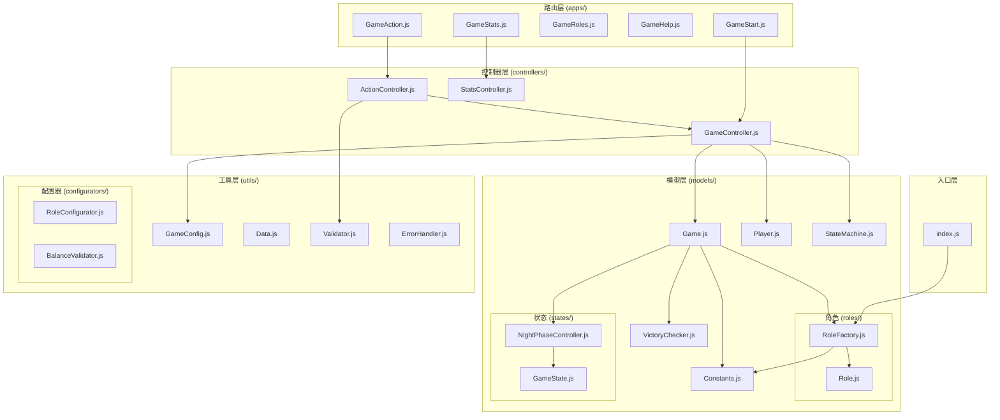

# werewolf-plugin 项目索引

> 狼人杀游戏插件 - 支持多人在线狼人杀游戏

## 项目概述

werewolf-plugin 是一个基于 Miao-Yunzai 框架的狼人杀游戏插件，采用 **MVC 架构** 和 ES Modules，实现了完整的狼人杀游戏逻辑，包括角色分配、夜晚行动、白天投票等核心玩法。

**技术栈**：Node.js 18+, ES Modules, Puppeteer (图片渲染), YAML (配置管理)

## 目录结构

```
werewolf-plugin/
├── index.js                    # 主入口，动态加载应用
├── apps/                       # 路由层（Miao-Yunzai 命令处理）
│   ├── GameStart.js           # 游戏启动和大厅管理
│   ├── GameAction.js          # 游戏行动处理（投票、技能等）
│   ├── GameRoles.js           # 角色管理命令
│   ├── GameHelp.js            # 帮助信息
│   ├── GameStats.js           # 玩家统计
│   └── update.js              # 插件更新
├── controllers/                # 控制器层（业务协调）
│   ├── GameController.js      # 游戏生命周期管理
│   ├── ActionController.js    # 玩家行动处理
│   └── StatsController.js     # 统计数据处理
├── models/                     # 模型层（核心业务逻辑）
│   ├── Game.js                # 游戏聚合根
│   ├── Player.js              # 玩家实体
│   ├── Constants.js           # 游戏常量
│   ├── StateMachine.js        # 状态机
│   ├── VictoryChecker.js      # 胜利条件检查
│   ├── PhaseManager.js        # 阶段管理器
│   ├── PhaseCoordinator.js    # 阶段协调器
│   ├── StateCallback.js       # 状态回调
│   ├── PlayerStats.js         # 玩家统计模型
│   ├── roles/                 # 角色策略
│   │   ├── Role.js            # 角色基类
│   │   ├── RoleFactory.js     # 角色工厂
│   │   ├── WolfRole.js        # 狼人
│   │   ├── VillagerRole.js    # 村民
│   │   ├── ProphetRole.js     # 预言家
│   │   ├── WitchRole.js       # 女巫
│   │   ├── HunterRole.js      # 猎人
│   │   └── GuardRole.js       # 守卫
│   └── states/                # 状态策略
│       ├── GameState.js       # 状态基类
│       ├── NightPhaseState.js # 夜晚阶段基类
│       ├── NightPhaseController.js # 夜晚控制器
│       ├── InformationPhaseState.js # 信息收集阶段
│       ├── EliminationPhaseState.js # 消除阶段
│       ├── InterventionPhaseState.js # 干预阶段
│       ├── DayState.js        # 白天讨论
│       ├── VoteState.js       # 投票
│       ├── LastWordsState.js  # 遗言
│       ├── SheriffElectState.js # 警长竞选
│       └── SheriffTransferState.js # 警长移交
├── utils/                      # 工具层
│   ├── index.js               # 统一导出
│   ├── GameConfig.js          # 游戏配置管理
│   ├── Data.js                # 数据持久化
│   ├── YamlReader.js          # YAML 读取工具
│   ├── Puppeteer.js           # 图片渲染
│   ├── PlayerStats.js         # 统计工具
│   ├── constants.js           # 工具常量
│   ├── Validator.js           # 验证工具
│   ├── ErrorHandler.js        # 错误处理
│   ├── ErrorCodes.js          # 错误码定义
│   ├── GameError.js           # 游戏错误类
│   └── configurators/         # 配置器
│       ├── RoleConfigurator.js # 角色配置器
│       ├── BalanceValidator.js # 平衡验证器
│       ├── GameTemplates.js   # 游戏模板
│       └── RoleData.js        # 角色数据
├── config/                     # 配置文件
│   ├── config/                # 用户配置（可覆盖）
│   ├── default_config/        # 默认配置
│   └── system/                # 系统配置
├── resources/                  # 静态资源
│   ├── help/                  # 帮助页面模板
│   └── vote/                  # 投票结果模板
├── data/                       # 运行时数据
├── tests/                      # 单元测试
└── Docs/                       # 文档
```

## MVC 架构说明

### 1. 路由层 (apps/)

Miao-Yunzai 插件应用，负责命令路由和参数解析，委托 controllers 处理：

| 文件 | 类名 | 职责 |
|------|------|------|
| GameStart.js | GameStart | 创建房间、加入游戏、开始游戏 |
| GameAction.js | GameAction | 投票、使用技能、警长操作 |
| GameRoles.js | GameRoles | 角色列表、角色配置 |
| GameHelp.js | GameHelp | 帮助信息展示 |
| GameStats.js | GameStats | 玩家数据统计 |

### 2. 控制器层 (controllers/)

业务协调层，管理游戏实例和协调模型层：

| 文件 | 职责 |
|------|------|
| GameController.js | 游戏/大厅生命周期管理，games/lobbies Map |
| ActionController.js | 玩家行动验证和分发 |
| StatsController.js | 统计数据查询和处理 |

### 3. 模型层 (models/)

核心业务逻辑，包含领域模型和策略：

**核心模型**:
- `Game.js` - 游戏聚合根，管理玩家、状态、胜利检查
- `Player.js` - 玩家实体
- `Constants.js` - 系统常量中心
- `StateMachine.js` - 状态机，管理游戏阶段转换

**角色策略 (roles/)**:

| 角色 | 阵营 | 夜晚技能 |
|------|------|----------|
| WolfRole | 狼人 | 袭击玩家 |
| VillagerRole | 好人 | 无 |
| ProphetRole | 好人 | 查验身份 |
| WitchRole | 好人 | 毒药/解药 |
| HunterRole | 好人 | 开枪带人 |
| GuardRole | 好人 | 守护玩家 |

**状态策略 (states/)**:

夜晚阶段采用分阶段控制器模式：
1. **InformationPhaseState** - 信息收集（预言家查验、守卫守护）
2. **EliminationPhaseState** - 消除阶段（狼人袭击）
3. **InterventionPhaseState** - 干预阶段（女巫用药）

白天阶段：
- **DayState** - 白天讨论
- **VoteState** - 投票处决
- **LastWordsState** - 遗言
- **SheriffElectState** - 警长竞选
- **SheriffTransferState** - 警长移交

### 4. 工具层 (utils/)

通用工具和配置管理：
- 配置读取和热更新
- 数据持久化
- 错误处理
- 验证工具
- 角色配置器

## 依赖关系图



## 设计模式

| 模式 | 应用位置 | 说明 |
|------|----------|------|
| MVC | 整体架构 | apps(路由) → controllers(协调) → models(业务) |
| 聚合根 | Game.js | 游戏作为聚合根，管理所有内部状态 |
| 工厂模式 | RoleFactory.js | 根据角色名称创建对应实例 |
| 策略模式 | roles/, states/ | 角色行为和游戏状态可插拔 |
| 状态模式 | StateMachine.js | 管理游戏状态转换 |

## 数据流

```
用户命令 → apps/*.js → controllers/*.js → models/Game.js → 状态转换 → 响应用户
```

## 配置说明

配置文件位于 `config/` 目录：

| 文件 | 说明 |
|------|------|
| game.yaml | 游戏规则配置（人数、时间等） |
| roles.yaml | 角色池配置 |
| modes.yaml | 游戏模式配置 |
| other.yaml | 其他配置 |

## 开发指南

### 添加新角色

1. 在 `models/roles/` 创建角色类，继承 `Role`
2. 在 `RoleFactory.js` 注册新角色
3. 在 `Constants.js` 添加角色常量
4. 在 `config/roles.yaml` 添加配置

### 添加新状态

1. 在 `models/states/` 创建状态类，继承 `GameState`
2. 在 `StateMachine.js` 添加状态转换规则
3. 在相关阶段控制器中集成

## 文件统计

- **JavaScript 文件**: 46 个（不含测试）
- **目录数**: 7 个（含代码的目录）
- **测试覆盖**: Jest 单元测试
- **无循环依赖**

---

*生成时间: 2026-01-03*
*索引版本: 2.1 (MVC 架构)*
