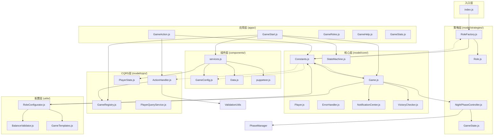

# werewolf-plugin 项目索引

> 狼人杀游戏插件 - 支持多人在线狼人杀游戏

## 项目概述

werewolf-plugin 是一个基于 Miao-Yunzai 框架的狼人杀游戏插件，采用 ES Modules 架构，实现了完整的狼人杀游戏逻辑，包括角色分配、夜晚行动、白天投票等核心玩法。

**技术栈**：Node.js 18+, ES Modules, Puppeteer (图片渲染), YAML (配置管理)

## 目录结构

```
werewolf-plugin/
├── index.js                    # 主入口，动态加载应用
├── apps/                       # 应用插件层（Miao-Yunzai 命令处理）
│   ├── GameStart.js           # 游戏启动和大厅管理
│   ├── GameAction.js          # 游戏行动处理（投票、技能等）
│   ├── GameRoles.js           # 角色管理命令
│   ├── GameHelp.js            # 帮助信息
│   ├── GameStats.js           # 玩家统计
│   └── update.js              # 插件更新
├── components/                 # 基础组件和服务
│   ├── services.js            # 服务定位器（统一导出）
│   ├── GameConfig.js          # 游戏配置管理
│   ├── Data.js                # 数据持久化
│   ├── YamlReader.js          # YAML 读取工具
│   ├── puppeteer.js           # 图片渲染
│   └── constants.js           # 组件常量
├── config/                     # 配置文件
│   ├── config/                # 用户配置（可覆盖）
│   ├── default_config/        # 默认配置
│   └── system/                # 系统配置
├── model/                      # 核心业务逻辑
│   ├── core/                  # 核心类
│   │   ├── Game.js            # 游戏聚合根
│   │   ├── Player.js          # 玩家实体
│   │   ├── Constants.js       # 游戏常量
│   │   ├── StateMachine.js    # 状态机
│   │   └── ...               # 错误处理、通知等
│   ├── cqrs/                  # CQRS 模式实现
│   │   ├── GameRegistry.js    # 游戏实例注册
│   │   ├── ActionHandler.js   # 命令处理器
│   │   ├── PlayerQueryService.js # 查询服务
│   │   └── PlayerStats.js     # 玩家统计
│   ├── managers/              # 管理器
│   │   └── PhaseManager.js    # 阶段管理
│   └── strategies/            # 策略模式实现
│       ├── roles/             # 角色策略
│       └── states/            # 状态策略
├── utils/                      # 工具函数
│   └── configurators/         # 配置器
├── resources/                  # 静态资源
│   ├── help/                  # 帮助页面模板
│   └── vote/                  # 投票结果模板
├── data/                       # 运行时数据
└── Docs/                       # 文档
```

## 核心模块说明

### 1. 入口层 (index.js)

主入口文件，负责：
- 动态加载 `apps/` 目录下的所有插件应用
- 预加载角色模块以提高性能

### 2. 应用层 (apps/)

Miao-Yunzai 插件应用，每个类对应一组命令：

| 文件 | 类名 | 职责 |
|------|------|------|
| GameStart.js | GameStart | 创建房间、加入游戏、开始游戏 |
| GameAction.js | GameAction | 投票、使用技能、警长操作 |
| GameRoles.js | GameRoles | 角色列表、角色配置 |
| GameHelp.js | GameHelp | 帮助信息展示 |
| GameStats.js | GameStats | 玩家数据统计 |

### 3. 核心层 (model/core/)

**Game.js** - 游戏聚合根，协调所有游戏逻辑：
- 管理玩家列表和状态
- 协调角色分配
- 处理游戏阶段转换
- 检查胜利条件

**Constants.js** - 系统常量中心，定义：
- 角色类型 (ROLES)
- 阵营 (CAMPS)
- 游戏阶段 (GAME_PHASES)
- 玩家状态 (PLAYER_STATES)
- 夜晚阶段配置 (NIGHT_PHASE_CONFIG)

### 4. 策略层 (model/strategies/)

#### 角色策略 (roles/)

| 角色 | 阵营 | 夜晚技能 |
|------|------|----------|
| WolfRole | 狼人 | 袭击玩家 |
| VillagerRole | 好人 | 无 |
| ProphetRole | 好人 | 查验身份 |
| WitchRole | 好人 | 毒药/解药 |
| HunterRole | 好人 | 开枪带人 |
| GuardRole | 好人 | 守护玩家 |

#### 状态策略 (states/)

夜晚阶段采用分阶段控制器模式：
1. **InformationPhaseState** - 信息收集（预言家查验、守卫守护）
2. **EliminationPhaseState** - 消除阶段（狼人袭击）
3. **InterventionPhaseState** - 干预阶段（女巫用药）

白天阶段：
- **DayState** - 白天讨论
- **VoteState** - 投票处决
- **LastWordsState** - 遗言
- **SheriffElectState** - 警长竞选
- **SheriffTransferState** - 警长移交

## 依赖关系图



## 设计模式

| 模式 | 应用位置 | 说明 |
|------|----------|------|
| 聚合根 | Game.js | 游戏作为聚合根，管理所有内部状态 |
| 工厂模式 | RoleFactory.js | 根据角色名称创建对应实例 |
| 策略模式 | roles/, states/ | 角色行为和游戏状态可插拔 |
| 状态模式 | StateMachine.js | 管理游戏状态转换 |
| 服务定位器 | services.js | 集中管理核心服务实例 |
| CQRS | model/cqrs/ | 命令和查询分离 |
| 观察者模式 | NotificationCenter.js | 游戏事件通知 |

## 数据流

```
用户命令 → apps/*.js → ActionHandler/GameRegistry → Game → 状态转换 → 通知中心 → 响应用户
```

## 配置说明

配置文件位于 `config/` 目录：

| 文件 | 说明 |
|------|------|
| game.yaml | 游戏规则配置（人数、时间等） |
| roles.yaml | 角色池配置 |
| modes.yaml | 游戏模式配置 |
| other.yaml | 其他配置 |

## 开发指南

### 添加新角色

1. 在 `model/strategies/roles/` 创建角色类，继承 `Role`
2. 在 `RoleFactory.js` 注册新角色
3. 在 `Constants.js` 添加角色常量
4. 在 `config/roles.yaml` 添加配置

### 添加新状态

1. 在 `model/strategies/states/` 创建状态类，继承 `GameState`
2. 在 `StateMachine.js` 添加状态转换规则
3. 在相关阶段控制器中集成

## 文件统计

- **JavaScript 文件**: 54 个
- **目录数**: 9 个（含代码的目录）
- **依赖层级**: 11 层
- **无循环依赖**

---

*生成时间: 2025-12-30*
*索引版本: 1.0*
