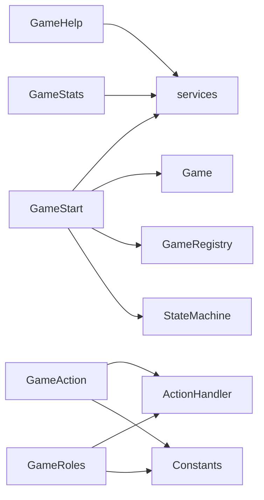

# apps - 应用插件层

## 概述

此目录包含 Miao-Yunzai 框架的插件应用类，每个类继承自 `plugin` 基类，定义了用户可以触发的命令和对应的处理逻辑。

## 文件列表

| 文件名 | 类名 | 描述 | 主要依赖 |
|--------|------|------|----------|
| GameStart.js | GameStart | 游戏启动和大厅管理 | services, Game, GameRegistry, StateMachine |
| GameAction.js | GameAction | 游戏行动处理（投票、技能、警长操作） | ActionHandler, Constants, 各状态类 |
| GameRoles.js | GameRoles | 角色管理命令 | ActionHandler, Constants |
| GameHelp.js | GameHelp | 帮助信息展示 | services, lodash |
| GameStats.js | GameStats | 玩家数据统计展示 | services |
| update.js | WerewolfUpdate | 插件更新检查 | other/update.js |

## 目录职责

1. **命令路由**: 定义正则规则匹配用户输入
2. **权限控制**: 检查用户是否有权限执行命令
3. **参数解析**: 从消息中提取参数
4. **业务委托**: 将具体逻辑委托给 model 层处理
5. **响应输出**: 格式化并发送响应消息

## 命令一览

### GameStart.js
| 命令 | 正则 | 说明 |
|------|------|------|
| 创建游戏 | `^#?(创建|开房|狼人杀)` | 创建新的游戏房间 |
| 加入游戏 | `^#?(加入|参加)(游戏)?` | 加入已创建的房间 |
| 开始游戏 | `^#?开始(游戏)?` | 房主开始游戏 |
| 离开房间 | `^#?(离开|退出)(房间)?` | 离开当前房间 |

### GameAction.js
| 命令 | 正则 | 说明 |
|------|------|------|
| 投票 | `^#?投票?\s*(\d+)?` | 投票处决玩家 |
| 使用技能 | `^#?(查验|守护|毒杀|救人|开枪)` | 角色技能 |
| 警长操作 | `^#?(上警|退水|移交警徽)` | 警长竞选相关 |

### GameRoles.js
| 命令 | 正则 | 说明 |
|------|------|------|
| 角色列表 | `^#?角色(列表)?` | 查看可用角色 |
| 配置角色 | `^#?配置角色` | 自定义角色组合 |

### GameHelp.js
| 命令 | 正则 | 说明 |
|------|------|------|
| 帮助 | `^#?(狼人杀)?帮助` | 显示帮助信息 |

### GameStats.js
| 命令 | 正则 | 说明 |
|------|------|------|
| 我的战绩 | `^#?(我的)?战绩` | 查看个人统计 |
| 排行榜 | `^#?排行(榜)?` | 查看玩家排行 |

## 依赖关系



## 开发指南

### 添加新命令

1. 在对应的应用类中添加 `rule` 配置
2. 实现处理方法
3. 处理方法返回 `true` 表示命令已处理

### 应用类模板

```javascript
import plugin from '../../../lib/plugins/plugin.js'

export class MyApp extends plugin {
  constructor() {
    super({
      name: '应用名称',
      dsc: '应用描述',
      event: 'message',
      priority: 500,
      rule: [
        {
          reg: '^#?命令正则',
          fnc: 'handleCommand'
        }
      ]
    })
  }

  async handleCommand(e) {
    // 处理逻辑
    return true
  }
}
```
