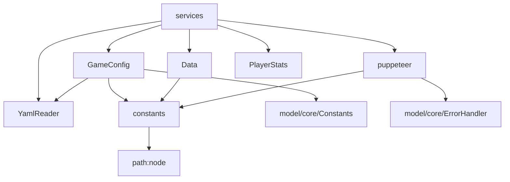

# components - 基础组件层

## 概述

此目录包含插件的基础组件和服务类，提供配置管理、数据持久化、图片渲染等核心功能。`services.js` 作为服务定位器，统一导出所有组件实例。

## 文件列表

| 文件名 | 导出 | 描述 | 主要依赖 |
|--------|------|------|----------|
| services.js | Data, GameConfig, YamlReader, Puppeteer, PlayerStats | 服务定位器，统一导出所有服务 | 所有组件 |
| GameConfig.js | GameConfig | 游戏配置管理（热更新） | yaml, chokidar, YamlReader, Constants |
| Data.js | Data | 数据管理和缓存 | lodash, fs, constants |
| YamlReader.js | YamlReader | YAML 文件读取工具 | fs, yaml, lodash |
| puppeteer.js | Puppeteer | 图片渲染管理 | puppeteer, ErrorHandler |
| constants.js | PLUGIN_NAME, PLUGIN_PATH, _path | 组件级常量 | path |

## 目录职责

1. **配置管理**: 加载、验证、热更新游戏配置
2. **数据持久化**: 玩家数据的读写和缓存
3. **图片生成**: 使用 Puppeteer 渲染 HTML 为图片
4. **文件操作**: YAML 配置文件的读写

## 组件详情

### services.js - 服务定位器

统一导出点，简化模块间依赖：

```javascript
import { Data, GameConfig, Puppeteer, PlayerStats } from './components/services.js'
```

### GameConfig.js - 配置管理器

特性：
- 配置文件热更新（使用 chokidar 监听）
- 配置验证和默认值合并
- 支持用户配置覆盖默认配置

配置路径优先级：
1. `config/config/*.yaml` (用户配置)
2. `config/default_config/*.yaml` (默认配置)

### Data.js - 数据管理器

功能：
- 玩家数据读写
- 内存缓存机制
- JSON 文件持久化

### puppeteer.js - 图片渲染器

功能：
- HTML 模板渲染为图片
- 支持自定义 CSS 和数据
- 错误重试机制

模板目录：`resources/`

### YamlReader.js - YAML 工具

功能：
- YAML 文件读取
- 深度合并配置
- 类型转换

## 依赖关系



## 外部依赖

| 包名 | 用途 |
|------|------|
| yaml | YAML 解析 |
| chokidar | 文件监听（热更新） |
| lodash | 深度合并、工具函数 |
| puppeteer | 浏览器自动化（渲染） |

## 使用示例

```javascript
import { Data, GameConfig, Puppeteer } from './components/services.js'

// 读取配置
const gameConfig = GameConfig.getConfig('game')

// 读取玩家数据
const playerData = Data.readPlayer(userId)

// 渲染图片
const image = await Puppeteer.render('help/help', {
  title: '帮助信息',
  items: [...]
})
```
