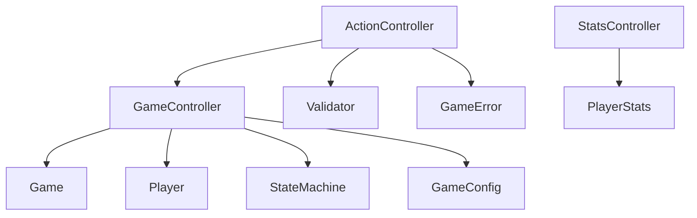

# controllers - 控制器层

## 概述

此目录包含 MVC 架构的控制器层，负责业务协调，管理游戏实例生命周期，将 apps 层的请求分发到 models 层。

## 文件列表

| 文件名 | 类名 | 职责 |
|--------|------|------|
| GameController.js | GameController | 游戏/大厅生命周期管理 |
| ActionController.js | ActionController | 玩家行动验证和分发 |
| StatsController.js | StatsController | 统计数据查询和处理 |

## 目录职责

1. **实例管理**: 维护游戏和大厅的 Map 存储
2. **业务协调**: 协调 models 层的多个组件
3. **验证分发**: 验证请求合法性，分发到对应处理器
4. **响应格式化**: 统一处理响应消息

## GameController

管理游戏生命周期：

```javascript
static games = new Map()   // groupId -> Game
static lobbies = new Map() // groupId -> Lobby

// 主要方法
static createGame(e)  // 创建大厅
static joinGame(e)    // 加入大厅
static startGame(e)   // 开始游戏
static endGame(e)     // 结束游戏
static getGame(groupId) // 获取游戏实例
```

## ActionController

处理玩家行动：

```javascript
// 主要方法
static vote(e, targetNumber)     // 投票
static useSkill(e, skillType, targetNumber) // 使用技能
static sheriffAction(e, action)  // 警长操作
```

## StatsController

处理统计查询：

```javascript
// 主要方法
static getPlayerStats(e)   // 获取玩家战绩
static getLeaderboard(e)   // 获取排行榜
```

## 依赖关系



## 设计原则

- **单一职责**: 每个控制器专注一个领域
- **薄控制器**: 业务逻辑在 models 层，控制器只做协调
- **静态方法**: 使用静态方法，无需实例化
