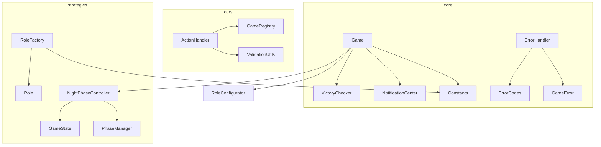

# model - 核心业务逻辑层

## 概述

此目录包含狼人杀游戏的核心业务逻辑，采用领域驱动设计 (DDD) 和 CQRS 模式。包含核心实体、状态管理、角色策略、游戏状态等模块。

## 子目录结构

```
model/
├── core/           # 核心类（聚合根、实体、值对象）
├── cqrs/           # CQRS 模式实现（命令/查询分离）
├── managers/       # 管理器（阶段管理）
└── strategies/     # 策略模式实现
    ├── roles/      # 角色策略
    └── states/     # 状态策略
```

## 子目录索引

- [core/FOLDER_INDEX.md](./core/FOLDER_INDEX.md) - 核心类
- [cqrs/FOLDER_INDEX.md](./cqrs/FOLDER_INDEX.md) - CQRS 实现
- [managers/FOLDER_INDEX.md](./managers/FOLDER_INDEX.md) - 管理器
- [strategies/roles/FOLDER_INDEX.md](./strategies/roles/FOLDER_INDEX.md) - 角色策略
- [strategies/states/FOLDER_INDEX.md](./strategies/states/FOLDER_INDEX.md) - 状态策略

## 模块职责

### core/ - 核心层

| 文件 | 职责 |
|------|------|
| Game.js | 游戏聚合根，协调所有游戏逻辑 |
| Player.js | 玩家实体 |
| Constants.js | 游戏常量定义 |
| StateMachine.js | 状态机实现 |
| ErrorHandler.js | 统一错误处理 |
| NotificationCenter.js | 事件通知中心 |
| VictoryChecker.js | 胜利条件检查 |

### cqrs/ - 命令查询分离

| 文件 | 职责 |
|------|------|
| GameRegistry.js | 游戏实例注册表 |
| ActionHandler.js | 玩家操作命令处理 |
| PlayerQueryService.js | 玩家信息查询 |
| PlayerStats.js | 玩家统计数据 |

### managers/ - 管理器

| 文件 | 职责 |
|------|------|
| PhaseManager.js | 游戏阶段管理和转换 |

### strategies/ - 策略层

#### roles/ - 角色策略
实现各角色的行为逻辑（技能、胜利条件等）

#### states/ - 状态策略
实现各游戏状态的行为逻辑（进入、处理、退出）

## 核心设计模式

### 1. 聚合根模式 (Game.js)

```javascript
class Game {
  // 内部状态
  #players = new Map()
  #currentState = null

  // 对外暴露的操作
  addPlayer(player) { ... }
  startGame() { ... }
  processAction(action) { ... }
}
```

### 2. 策略模式 (roles/, states/)

```javascript
// 角色基类
class Role {
  performNightAction(game, player, target) { throw new Error('需要实现') }
}

// 具体角色
class WolfRole extends Role {
  performNightAction(game, player, target) {
    // 狼人袭击逻辑
  }
}
```

### 3. 状态模式 (states/)

```javascript
// 状态基类
class GameState {
  onEnter(game) { }
  onExit(game) { }
  processMessage(game, message) { }
}

// 具体状态
class VoteState extends GameState {
  processMessage(game, message) {
    // 处理投票消息
  }
}
```

## 依赖关系



## 数据流

```
用户输入
    ↓
apps/*.js (命令解析)
    ↓
ActionHandler (命令处理)
    ↓
GameRegistry (获取游戏实例)
    ↓
Game (聚合根处理)
    ↓
StateMachine (状态转换)
    ↓
GameState (状态处理)
    ↓
NotificationCenter (发送通知)
    ↓
用户响应
```
