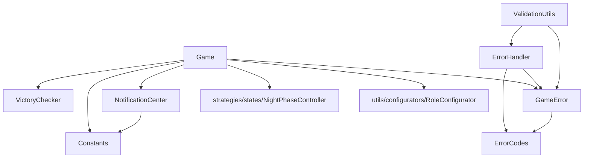

# model/core - 核心类

## 概述

此目录包含游戏的核心类，包括聚合根、实体、值对象、错误处理和通知系统。是整个业务逻辑的基础。

## 文件列表

| 文件名 | 导出 | 描述 | 主要依赖 |
|--------|------|------|----------|
| Constants.js | ROLES, CAMPS, GAME_PHASES, ... | 游戏常量定义，系统数据源 | 无 |
| Player.js | Player | 玩家实体类 | 无 |
| Game.js | Game | 游戏聚合根，协调所有游戏逻辑 | VictoryChecker, RoleConfigurator, NightPhaseController |
| StateMachine.js | GameStateType, StateMachine | 状态机实现 | 无 |
| ErrorCodes.js | ErrorSeverity, ErrorCodes, ... | 错误代码定义 | 无 |
| GameError.js | GameError | 游戏错误类 | ErrorCodes |
| ErrorHandler.js | ErrorHandler, defaultErrorHandler | 统一错误处理 | ErrorCodes, GameError |
| NotificationCenter.js | NotificationCenter | 事件通知中心 | Constants |
| VictoryChecker.js | VictoryChecker | 胜利条件检查器 | 无 |
| PhaseCoordinator.js | PhaseCoordinator | 阶段协调器 | 无 |
| StateCallback.js | StateCallback | 状态回调封装 | 无 |
| ValidationUtils.js | ValidationUtils | 验证工具类 | ErrorHandler, GameError |

## 核心类详情

### Constants.js - 常量中心

定义所有游戏常量，是整个系统的单一数据源：

```javascript
export const ROLES = { WOLF: 'wolf', VILLAGER: 'villager', ... }
export const CAMPS = { WOLF: 'wolf', GOOD: 'good' }
export const GAME_PHASES = { NIGHT: 'night', DAY: 'day', ... }
export const PLAYER_STATES = { ALIVE: 'alive', DEAD: 'dead' }
export const NIGHT_PHASE_ORDER = ['information', 'elimination', 'intervention']
```

### Game.js - 游戏聚合根

游戏核心类，作为聚合根管理所有内部状态：

```javascript
class Game {
  constructor(groupId, e) { ... }

  // 玩家管理
  addPlayer(player) { ... }
  getPlayer(playerId) { ... }
  getAlivePlayers() { ... }

  // 游戏流程
  start() { ... }
  processAction(action) { ... }
  checkVictory() { ... }

  // 阶段管理
  transitionTo(newState) { ... }
}
```

### Player.js - 玩家实体

封装玩家数据和基本行为：

```javascript
class Player {
  constructor(userId, nickname, number) { ... }

  // 状态查询
  isAlive() { ... }
  isSheriff() { ... }

  // 状态修改
  kill(reason) { ... }
  setSheriff(isSheriff) { ... }
}
```

### StateMachine.js - 状态机

管理游戏状态转换：

```javascript
export const GameStateType = {
  WAITING: 'waiting',
  NIGHT: 'night',
  DAY: 'day',
  VOTE: 'vote',
  // ...
}

export const StateTransitions = {
  waiting: ['night'],
  night: ['day'],
  day: ['vote', 'sheriff_elect'],
  // ...
}
```

### 错误处理体系

```
ErrorCodes.js  →  GameError.js  →  ErrorHandler.js
   (定义)           (封装)           (处理)
```

## 依赖关系



## 设计原则

1. **单一数据源**: Constants.js 定义所有常量
2. **聚合根模式**: Game 作为聚合根，外部只能通过 Game 修改内部状态
3. **统一错误处理**: 所有错误通过 ErrorHandler 处理
4. **无外部依赖**: 核心类不依赖外部库
