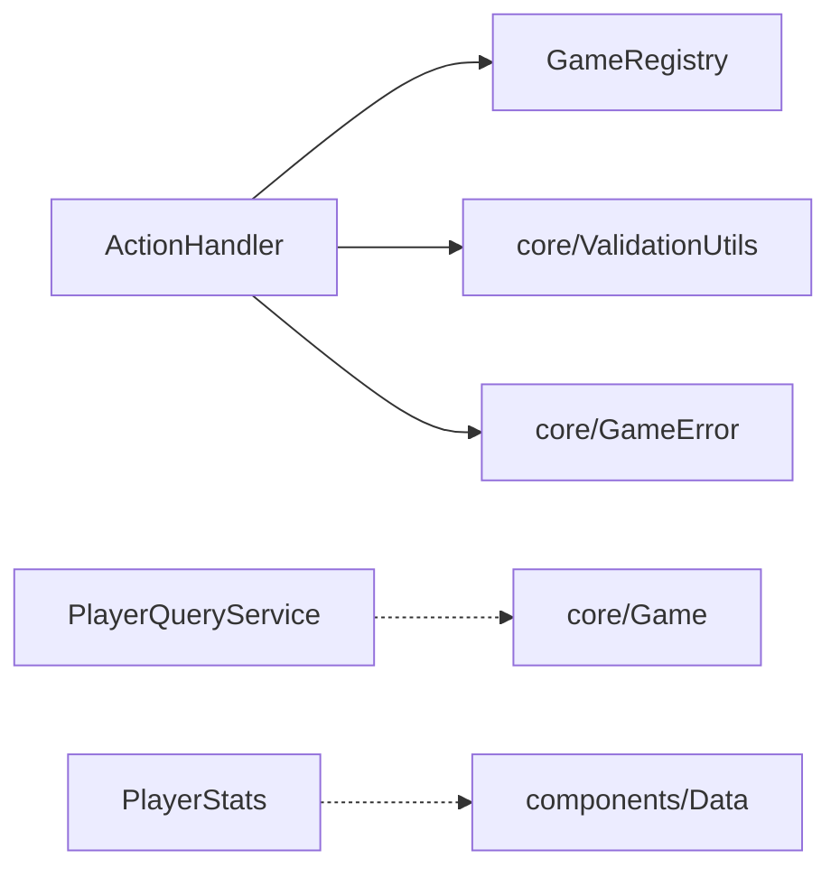

# model/cqrs - CQRS 模式实现

## 概述

此目录实现了 CQRS（命令查询职责分离）模式，将游戏操作分为命令（修改状态）和查询（读取状态）两类，提高代码可维护性和可测试性。

## 文件列表

| 文件名 | 导出 | 类型 | 描述 | 主要依赖 |
|--------|------|------|------|----------|
| GameRegistry.js | GameRegistry | 注册表 | 管理活跃游戏实例 | 无 |
| ActionHandler.js | ActionHandler | 命令 | 处理玩家游戏操作 | GameRegistry, ValidationUtils |
| PlayerQueryService.js | PlayerQueryService | 查询 | 玩家信息查询服务 | 无 |
| PlayerStats.js | PlayerStats | 查询 | 玩家统计数据管理 | 无 |

## 模块详情

### GameRegistry.js - 游戏注册表

管理所有活跃的游戏实例，提供游戏的创建、查找和销毁：

```javascript
class GameRegistry {
  static games = new Map()

  static createGame(groupId, e) { ... }
  static getGame(groupId) { ... }
  static removeGame(groupId) { ... }
  static hasGame(groupId) { ... }
}
```

### ActionHandler.js - 命令处理器

处理所有玩家操作命令，是应用层和领域层的桥梁：

```javascript
class ActionHandler {
  // 投票操作
  static async vote(e, targetNumber) { ... }

  // 技能操作
  static async useSkill(e, skillType, targetNumber) { ... }

  // 警长操作
  static async runForSheriff(e) { ... }
  static async transferBadge(e, targetNumber) { ... }
}
```

### PlayerQueryService.js - 查询服务

提供玩家信息的只读查询：

```javascript
class PlayerQueryService {
  static getPlayerInfo(game, playerId) { ... }
  static getAlivePlayersInfo(game) { ... }
  static getPlayerByNumber(game, number) { ... }
}
```

### PlayerStats.js - 统计服务

管理玩家的游戏统计数据：

```javascript
class PlayerStats {
  static getStats(playerId) { ... }
  static updateStats(playerId, gameResult) { ... }
  static getRanking(limit) { ... }
}
```

## CQRS 模式说明

### 命令（Command）
- 修改系统状态
- 不返回数据（或仅返回操作结果）
- 示例：投票、使用技能

### 查询（Query）
- 不修改系统状态
- 返回数据
- 示例：获取玩家信息、获取排行榜

## 依赖关系



## 使用示例

```javascript
import { ActionHandler } from './model/cqrs/ActionHandler.js'
import { GameRegistry } from './model/cqrs/GameRegistry.js'
import { PlayerQueryService } from './model/cqrs/PlayerQueryService.js'

// 创建游戏
GameRegistry.createGame(groupId, e)

// 执行命令
await ActionHandler.vote(e, targetNumber)

// 执行查询
const game = GameRegistry.getGame(groupId)
const players = PlayerQueryService.getAlivePlayersInfo(game)
```

## 设计优势

1. **关注点分离**: 命令和查询逻辑分离，易于维护
2. **可测试性**: 查询服务无副作用，易于单元测试
3. **可扩展性**: 可以独立优化命令和查询的实现
4. **单一职责**: 每个类职责明确
