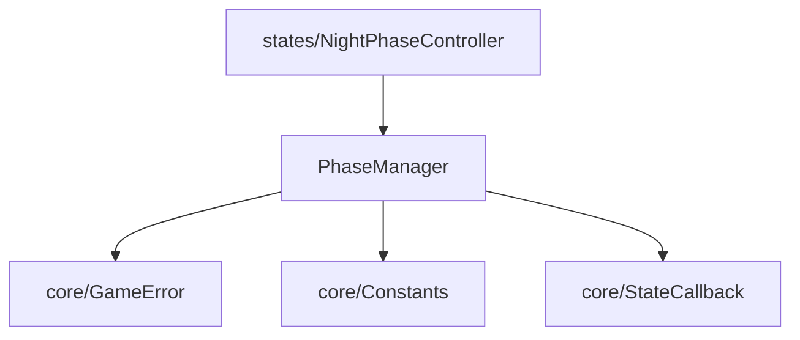

# model/managers - 管理器

## 概述

此目录包含游戏的管理器类，负责协调特定领域的业务逻辑。

## 文件列表

| 文件名 | 导出 | 描述 | 主要依赖 |
|--------|------|------|----------|
| PhaseManager.js | PhaseManager | 游戏阶段管理器 | GameError, Constants, StateCallback |

## 模块详情

### PhaseManager.js - 阶段管理器

管理游戏阶段的转换和协调，特别是夜晚的多阶段流程：

```javascript
class PhaseManager {
  constructor(game) {
    this.game = game
    this.currentPhase = null
    this.phaseOrder = NIGHT_PHASE_ORDER
  }

  // 阶段控制
  startPhase(phaseName) { ... }
  completeCurrentPhase() { ... }
  getNextPhase() { ... }

  // 状态查询
  isPhaseActive(phaseName) { ... }
  getCurrentPhase() { ... }
}
```

## 夜晚阶段流程

```
开始夜晚
    ↓
信息收集阶段 (Information)
  - 预言家查验
  - 守卫守护
    ↓
消除阶段 (Elimination)
  - 狼人袭击
    ↓
干预阶段 (Intervention)
  - 女巫用药（解药/毒药）
    ↓
结算
    ↓
天亮
```

## 依赖关系



## 使用示例

```javascript
// 在 NightPhaseController 中使用
class NightPhaseController extends GameState {
  constructor() {
    this.phaseManager = new PhaseManager(this.game)
  }

  onEnter(game) {
    this.phaseManager.startPhase('information')
  }

  onPhaseComplete() {
    const nextPhase = this.phaseManager.getNextPhase()
    if (nextPhase) {
      this.phaseManager.startPhase(nextPhase)
    } else {
      // 夜晚结束，进入白天
      game.transitionTo(new DayState())
    }
  }
}
```

## 设计原则

1. **单一职责**: PhaseManager 只负责阶段管理
2. **协调者模式**: 协调各阶段状态之间的转换
3. **配置驱动**: 阶段顺序由 Constants.NIGHT_PHASE_ORDER 定义
