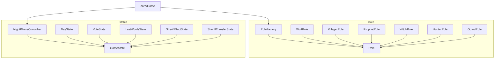

# model/strategies - 策略模式实现

## 概述

此目录包含策略模式的实现，将游戏中可变的行为（角色技能、游戏状态）封装为独立的策略类，实现开闭原则。

## 子目录结构

```
strategies/
├── roles/      # 角色策略（技能、胜利条件）
└── states/     # 状态策略（游戏阶段行为）
```

## 子目录索引

- [roles/FOLDER_INDEX.md](./roles/FOLDER_INDEX.md) - 角色策略
- [states/FOLDER_INDEX.md](./states/FOLDER_INDEX.md) - 状态策略

## 策略模式说明

### 角色策略 (roles/)

每个角色类实现相同的接口，但行为不同：

```javascript
class Role {
  // 夜晚行动
  performNightAction(game, player, target) { }

  // 获取行动提示
  getActionPrompt(game, player) { }

  // 检查是否可以行动
  canAct(game, player) { }
}
```

### 状态策略 (states/)

每个游戏状态类实现相同的接口：

```javascript
class GameState {
  // 进入状态
  onEnter(game) { }

  // 退出状态
  onExit(game) { }

  // 处理消息
  processMessage(game, e, message) { }
}
```

## 设计优势

1. **开闭原则**: 添加新角色/状态无需修改现有代码
2. **单一职责**: 每个策略类只负责自己的行为
3. **可替换性**: 策略可以在运行时动态切换
4. **可测试性**: 每个策略类可以独立测试

## 依赖关系



## 扩展指南

### 添加新角色

1. 创建角色类，继承 `Role`
2. 实现 `performNightAction()` 等方法
3. 在 `RoleFactory` 中注册
4. 在 `Constants.js` 中添加角色常量

### 添加新状态

1. 创建状态类，继承 `GameState`
2. 实现 `onEnter()`, `onExit()`, `processMessage()` 方法
3. 在 `StateMachine.js` 中添加状态转换规则
