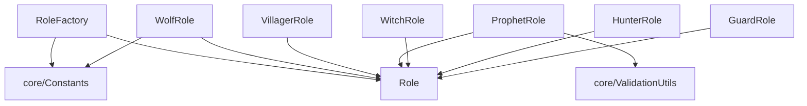

# model/strategies/roles - 角色策略

## 概述

此目录包含所有角色的策略实现，每个角色类封装了该角色的技能、胜利条件和行为逻辑。

## 文件列表

| 文件名 | 导出 | 阵营 | 技能 | 主要依赖 |
|--------|------|------|------|----------|
| Role.js | Role | - | 抽象基类 | 无 |
| RoleFactory.js | RoleFactory | - | 角色工厂 | Constants, 所有角色类 |
| WolfRole.js | WolfRole | 狼人 | 夜晚袭击 | Role, Constants |
| VillagerRole.js | VillagerRole | 好人 | 无 | Role |
| ProphetRole.js | ProphetRole | 好人 | 查验身份 | Role, ValidationUtils |
| WitchRole.js | WitchRole | 好人 | 解药/毒药 | Role |
| HunterRole.js | HunterRole | 好人 | 开枪带人 | Role |
| GuardRole.js | GuardRole | 好人 | 守护玩家 | Role |

## 角色详情

### Role.js - 抽象基类

定义角色的通用接口：

```javascript
class Role {
  constructor(name, camp) {
    this.name = name
    this.camp = camp
  }

  // 夜晚行动（子类实现）
  performNightAction(game, player, target) {
    throw new Error('需要子类实现')
  }

  // 获取行动提示
  getActionPrompt(game, player) { ... }

  // 检查是否可以行动
  canAct(game, player) { return true }

  // 获取胜利条件
  getVictoryCondition() { ... }
}
```

### RoleFactory.js - 角色工厂

根据角色名称创建对应的角色实例：

```javascript
class RoleFactory {
  static roleClasses = {
    [ROLES.WOLF]: WolfRole,
    [ROLES.VILLAGER]: VillagerRole,
    [ROLES.PROPHET]: ProphetRole,
    // ...
  }

  static create(roleName) {
    const RoleClass = this.roleClasses[roleName]
    return new RoleClass()
  }

  static preloadRoles() {
    // 预加载所有角色类，提高性能
  }
}
```

### 具体角色

#### WolfRole - 狼人
- **阵营**: 狼人阵营
- **技能**: 夜晚可以袭击一名玩家
- **胜利条件**: 消灭所有好人

#### VillagerRole - 村民
- **阵营**: 好人阵营
- **技能**: 无特殊技能
- **胜利条件**: 消灭所有狼人

#### ProphetRole - 预言家
- **阵营**: 好人阵营
- **技能**: 夜晚可以查验一名玩家的身份
- **胜利条件**: 消灭所有狼人

#### WitchRole - 女巫
- **阵营**: 好人阵营
- **技能**: 拥有一瓶解药（救人）和一瓶毒药（杀人）
- **胜利条件**: 消灭所有狼人
- **限制**: 每种药只能使用一次

#### HunterRole - 猎人
- **阵营**: 好人阵营
- **技能**: 死亡时可以开枪带走一名玩家
- **胜利条件**: 消灭所有狼人
- **限制**: 被毒杀时不能开枪

#### GuardRole - 守卫
- **阵营**: 好人阵营
- **技能**: 夜晚可以守护一名玩家（包括自己）
- **胜利条件**: 消灭所有狼人
- **限制**: 不能连续两晚守护同一人

## 依赖关系



## 扩展新角色

1. **创建角色类**:
```javascript
// model/strategies/roles/NewRole.js
import { Role } from './Role.js'

export class NewRole extends Role {
  constructor() {
    super('new_role', 'good')
  }

  performNightAction(game, player, target) {
    // 实现技能逻辑
  }
}
```

2. **注册到工厂**:
```javascript
// RoleFactory.js
import { NewRole } from './NewRole.js'

static roleClasses = {
  // ...
  [ROLES.NEW_ROLE]: NewRole
}
```

3. **添加常量**:
```javascript
// core/Constants.js
export const ROLES = {
  // ...
  NEW_ROLE: 'new_role'
}
```
