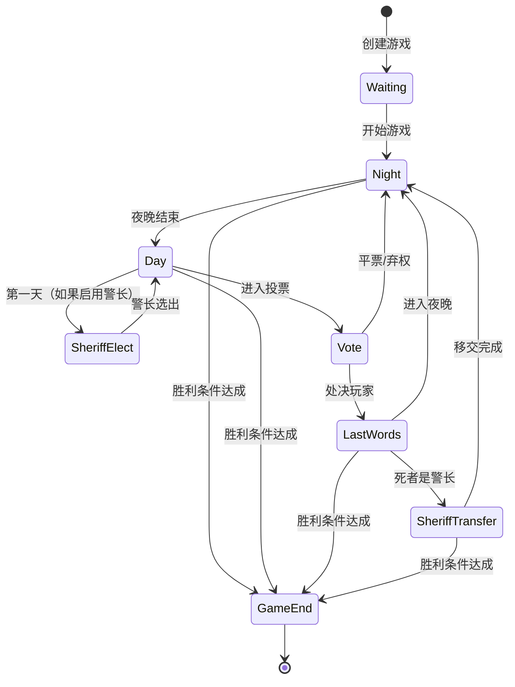
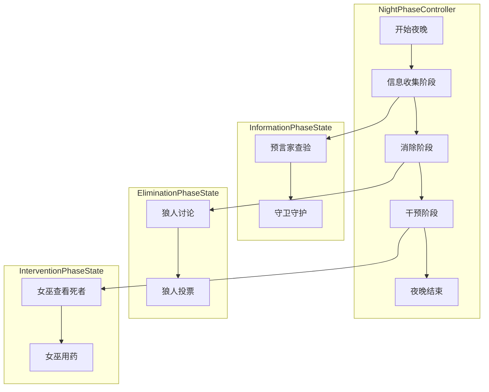
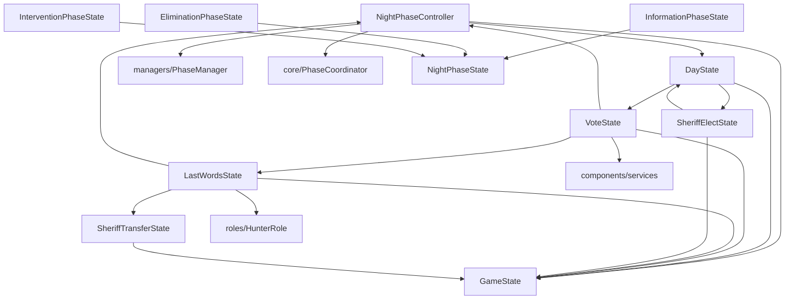

# model/strategies/states - 状态策略

## 概述

此目录包含游戏状态的策略实现，使用状态模式管理游戏的不同阶段，每个状态类封装了该阶段的行为逻辑。

## 文件列表

| 文件名 | 导出 | 类型 | 描述 | 主要依赖 |
|--------|------|------|------|----------|
| GameState.js | GameState | 基类 | 状态抽象基类 | 无 |
| NightPhaseController.js | NightPhaseController | 控制器 | 夜晚阶段控制器 | GameState, PhaseManager |
| NightPhaseState.js | NightPhaseState | 基类 | 夜晚子阶段基类 | GameError |
| InformationPhaseState.js | InformationPhaseState | 夜晚 | 信息收集阶段 | NightPhaseState |
| EliminationPhaseState.js | EliminationPhaseState | 夜晚 | 消除阶段 | NightPhaseState |
| InterventionPhaseState.js | InterventionPhaseState | 夜晚 | 干预阶段 | NightPhaseState |
| DayState.js | DayState | 白天 | 白天讨论阶段 | GameState |
| VoteState.js | VoteState | 白天 | 投票阶段 | GameState, services |
| LastWordsState.js | LastWordsState | 白天 | 遗言阶段 | GameState |
| SheriffElectState.js | SheriffElectState | 警长 | 警长竞选阶段 | GameState |
| SheriffTransferState.js | SheriffTransferState | 警长 | 警长移交阶段 | GameState |

## 状态流转图



## 夜晚子阶段流程



## 状态基类

### GameState.js

```javascript
class GameState {
  // 进入状态时调用
  onEnter(game) { }

  // 退出状态时调用
  onExit(game) { }

  // 处理玩家消息
  async processMessage(game, e, message) { }

  // 获取状态名称
  getName() { return 'base' }
}
```

### NightPhaseState.js

夜晚子阶段的基类：

```javascript
class NightPhaseState {
  constructor(controller) {
    this.controller = controller
  }

  // 开始阶段
  async start(game) { }

  // 处理玩家行动
  async handleAction(game, player, action) { }

  // 检查阶段是否完成
  isComplete(game) { }

  // 结束阶段
  async complete(game) { }
}
```

## 状态详情

### 夜晚状态

| 状态 | 行动角色 | 主要操作 |
|------|----------|----------|
| InformationPhaseState | 预言家、守卫 | 查验身份、守护玩家 |
| EliminationPhaseState | 狼人 | 讨论并选择袭击目标 |
| InterventionPhaseState | 女巫 | 查看死者、使用药水 |

### 白天状态

| 状态 | 触发条件 | 主要操作 |
|------|----------|----------|
| DayState | 夜晚结束 | 公布死讯、自由讨论 |
| VoteState | 讨论结束 | 投票处决 |
| LastWordsState | 有玩家被处决 | 发表遗言 |
| SheriffElectState | 第一天 | 警长竞选 |
| SheriffTransferState | 警长死亡 | 移交警徽 |

## 依赖关系



## 扩展新状态

1. **创建状态类**:
```javascript
import { GameState } from './GameState.js'

export class NewState extends GameState {
  onEnter(game) {
    // 进入状态时的初始化
  }

  async processMessage(game, e, message) {
    // 处理玩家消息
  }

  onExit(game) {
    // 清理工作
  }

  getName() {
    return 'new_state'
  }
}
```

2. **添加状态转换规则**:
```javascript
// core/StateMachine.js
export const StateTransitions = {
  // ...
  some_state: ['new_state'],
  new_state: ['next_state']
}
```
