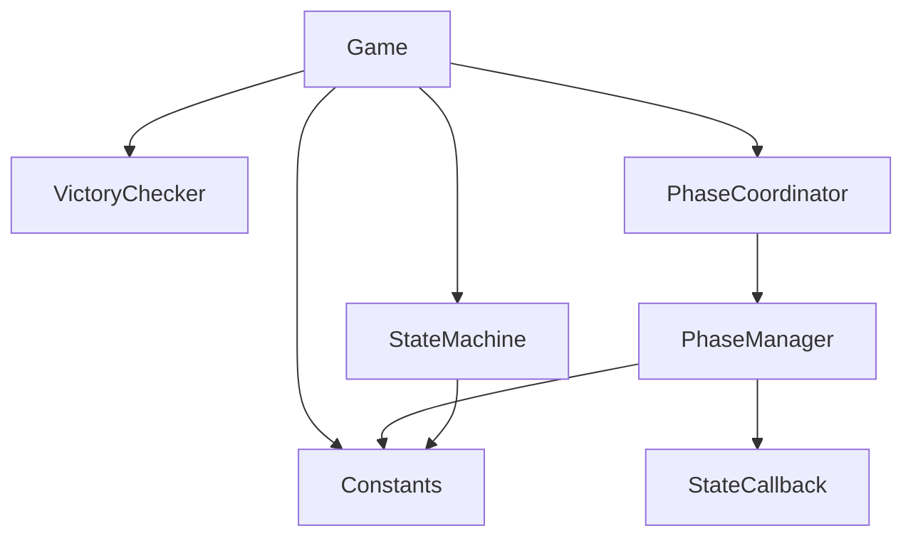

# models - 模型层

## 概述

此目录包含狼人杀游戏的核心业务逻辑，采用聚合根模式管理游戏状态，策略模式实现角色和状态的可插拔设计。

## 子目录结构

```
models/
├── roles/          # 角色策略
└── states/         # 状态策略
```

## 子目录索引

- [roles/FOLDER_INDEX.md](./roles/FOLDER_INDEX.md) - 角色策略
- [states/FOLDER_INDEX.md](./states/FOLDER_INDEX.md) - 状态策略

## 文件列表

| 文件名 | 描述 | 主要导出 |
|--------|------|----------|
| Game.js | 游戏聚合根，协调所有游戏逻辑 | `Game` |
| Player.js | 玩家实体，封装玩家状态 | `Player` |
| Constants.js | 系统常量中心 | `ROLES`, `CAMPS`, `GAME_PHASES`, `ACTIONS` 等 |
| StateMachine.js | 状态机，管理游戏阶段转换 | `GameStateType`, `StateTransitions`, `StateMachine` |
| VictoryChecker.js | 胜利条件检查器 | `VictoryChecker` |
| PhaseManager.js | 夜晚阶段管理器 | `PhaseManager` |
| PhaseCoordinator.js | 阶段协调器 | `PhaseCoordinator` |
| StateCallback.js | 状态回调机制 | `StateCallback` |
| PlayerStats.js | 玩家统计模型 | `PlayerStats` |

## 目录职责

1. **游戏聚合根** (Game.js): 管理玩家、状态机、胜利检查
2. **实体定义** (Player.js): 玩家数据和行为封装
3. **状态管理** (StateMachine.js): 游戏阶段转换规则
4. **阶段协调** (PhaseManager.js, PhaseCoordinator.js): 夜晚子阶段流程控制
5. **策略实现** (roles/, states/): 可插拔的角色和状态行为

## 依赖关系



## 设计模式

| 模式 | 应用位置 | 说明 |
|------|----------|------|
| 聚合根 | Game.js | 游戏作为聚合根管理所有内部状态 |
| 状态模式 | StateMachine.js | 管理游戏状态转换 |
| 策略模式 | roles/, states/ | 角色行为和状态逻辑可插拔 |
| 回调模式 | StateCallback.js | 状态间通信机制 |
