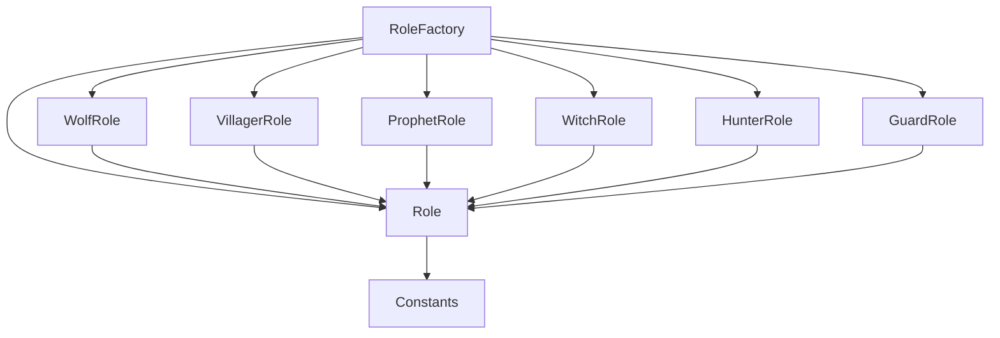

# roles - 角色策略

## 概述

此目录包含狼人杀游戏的角色实现，采用策略模式，所有角色继承自 `Role` 基类。

## 文件列表

| 文件名 | 角色 | 阵营 | 夜晚技能 |
|--------|------|------|----------|
| Role.js | 基类 | - | 定义角色接口 |
| RoleFactory.js | 工厂 | - | 根据名称创建角色实例 |
| WolfRole.js | 狼人 | 狼人阵营 | 投票袭击玩家 |
| VillagerRole.js | 村民 | 好人阵营 | 无 |
| ProphetRole.js | 预言家 | 好人阵营 | 查验玩家身份 |
| WitchRole.js | 女巫 | 好人阵营 | 毒药/解药 |
| HunterRole.js | 猎人 | 好人阵营 | 死亡时开枪带人 |
| GuardRole.js | 守卫 | 好人阵营 | 守护玩家免受狼人袭击 |

## 目录职责

1. **角色基类** (Role.js): 定义角色通用接口和默认行为
2. **角色工厂** (RoleFactory.js): 根据角色名称创建对应实例
3. **具体角色**: 实现各角色的技能逻辑

## 角色接口

每个角色类需实现以下方法：

```javascript
class SomeRole extends Role {
  // 获取角色名称
  get name() { return '角色名' }

  // 获取角色阵营
  get camp() { return CAMPS.GOOD | CAMPS.WOLF }

  // 夜晚行动（可选）
  async nightAction(game, targetId) { }

  // 获取行动提示
  getActionPrompt() { return '请选择目标...' }

  // 验证行动目标是否有效
  validateTarget(game, targetId) { return { valid: true } }
}
```

## 依赖关系



## 添加新角色

1. 创建 `NewRole.js`，继承 `Role` 基类
2. 实现必要的方法 (`name`, `camp`, `nightAction` 等)
3. 在 `RoleFactory.js` 中注册新角色
4. 在 `Constants.js` 添加角色常量
5. 在 `config/roles.yaml` 添加配置
