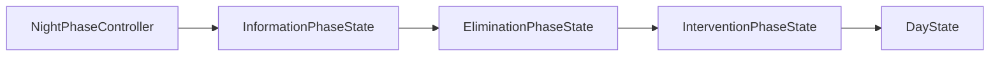
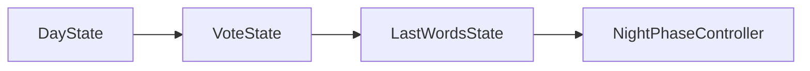
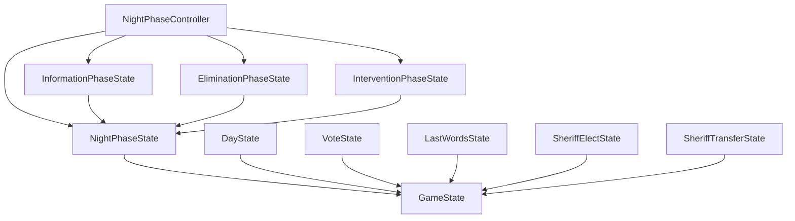

# states - 状态策略

## 概述

此目录包含狼人杀游戏的状态实现，采用状态模式管理游戏阶段。夜晚阶段采用分阶段控制器模式，将夜晚拆分为三个子阶段。

## 文件列表

| 文件名 | 状态 | 描述 |
|--------|------|------|
| GameState.js | 基类 | 定义状态接口 |
| NightPhaseState.js | 夜晚基类 | 夜晚子阶段通用功能 |
| NightPhaseController.js | 夜晚控制器 | 协调夜晚三个子阶段 |
| InformationPhaseState.js | 信息收集阶段 | 预言家查验、守卫守护 |
| EliminationPhaseState.js | 消除阶段 | 狼人袭击 |
| InterventionPhaseState.js | 干预阶段 | 女巫用药 |
| DayState.js | 白天讨论 | 玩家讨论阶段 |
| VoteState.js | 投票 | 投票处决玩家 |
| LastWordsState.js | 遗言 | 被处决玩家发表遗言 |
| SheriffElectState.js | 警长竞选 | 上警、演讲、投票 |
| SheriffTransferState.js | 警长移交 | 警长死亡时移交警徽 |

## 夜晚阶段流程



1. **信息收集阶段** (InformationPhaseState)
   - 预言家查验玩家身份
   - 守卫选择守护目标

2. **消除阶段** (EliminationPhaseState)
   - 狼人投票选择袭击目标
   - 处理狼人内部沟通

3. **干预阶段** (InterventionPhaseState)
   - 女巫决定是否使用解药救人
   - 女巫决定是否使用毒药杀人

## 白天阶段流程



## 状态接口

每个状态类需实现以下方法：

```javascript
class SomeState extends GameState {
  // 进入状态时调用
  async onEnter(game) { }

  // 退出状态时调用
  async onExit(game) { }

  // 处理玩家行动
  async handleAction(game, playerId, action) { }

  // 获取状态名称
  get stateName() { return 'SomeState' }
}
```

## 依赖关系


