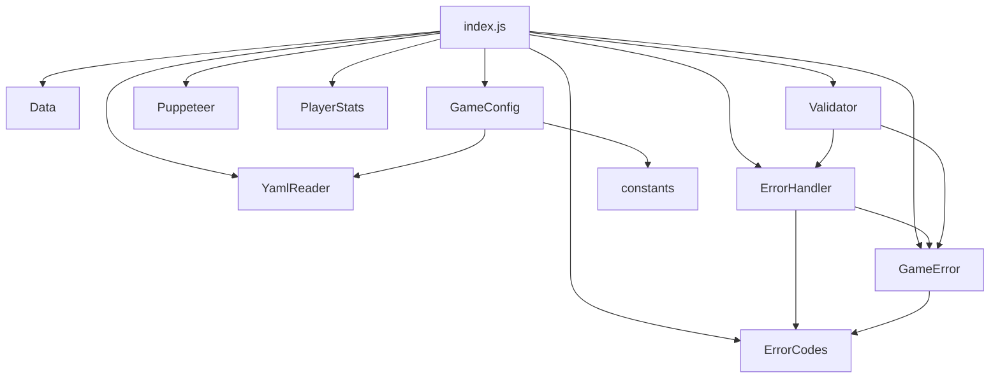

# utils - 工具函数

## 概述

此目录包含项目的工具函数和配置器，提供配置管理、数据持久化、错误处理、验证等功能。

## 子目录结构

```
utils/
└── configurators/    # 配置器
```

## 子目录索引

- [configurators/FOLDER_INDEX.md](./configurators/FOLDER_INDEX.md) - 配置器

## 文件列表

| 文件名 | 导出 | 描述 |
|--------|------|------|
| index.js | 统一导出 | 工具模块统一入口 |
| constants.js | _path, PLUGIN_NAME, PLUGIN_PATH | 插件路径常量 |
| GameConfig.js | GameConfig | 游戏配置管理，支持热更新 |
| Data.js | Data | 数据持久化工具 |
| YamlReader.js | YamlReader | YAML 文件读取工具 |
| Puppeteer.js | Puppeteer | 图片渲染工具 |
| PlayerStats.js | PlayerStats | 玩家统计工具 |
| Validator.js | ValidationUtils | 输入验证工具 |
| ErrorHandler.js | ErrorHandler, defaultErrorHandler | 统一错误处理器 |
| ErrorCodes.js | ErrorSeverity, ErrorCategory, ErrorCodes | 错误代码定义 |
| GameError.js | GameError | 游戏错误类 |

## 目录职责

1. **配置管理** (GameConfig.js): 游戏配置读取和热更新
2. **数据持久化** (Data.js): 玩家数据存储
3. **错误处理** (ErrorHandler.js, ErrorCodes.js, GameError.js): 统一错误处理体系
4. **验证工具** (Validator.js): 输入验证和校验
5. **渲染工具** (Puppeteer.js): 图片渲染
6. **配置器** (configurators/): 角色配置和平衡验证

## 依赖关系



## 使用示例

```javascript
// 统一导入
import { Data, GameConfig, ErrorHandler, GameError } from './utils/index.js'

// 单独导入
import GameConfig from './utils/GameConfig.js'
import { ValidationUtils } from './utils/Validator.js'
```
