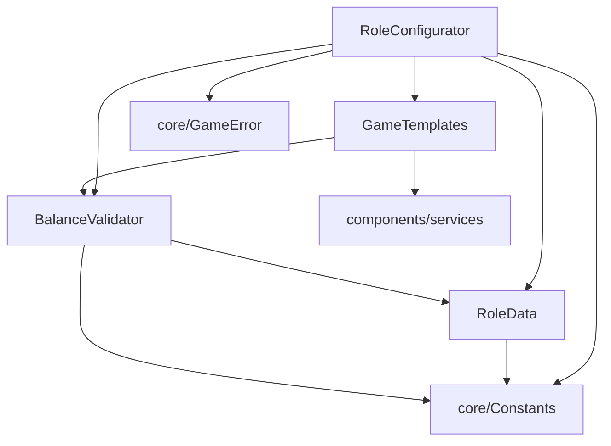

# utils/configurators - 配置器

## 概述

此目录包含游戏配置相关的工具类，负责角色组合的生成、验证和平衡性检查。

## 文件列表

| 文件名 | 导出 | 描述 | 主要依赖 |
|--------|------|------|----------|
| RoleConfigurator.js | RoleConfigurator | 角色配置器，生成和验证角色组合 | GameTemplates, RoleData, BalanceValidator |
| GameTemplates.js | GameTemplates | 游戏模板管理 | services, BalanceValidator |
| RoleData.js | RoleData | 角色数据和属性 | Constants |
| BalanceValidator.js | BalanceValidator | 平衡验证器 | RoleData, Constants |

## 模块详情

### RoleConfigurator.js - 角色配置器

核心配置类，负责角色组合的生成和验证：

```javascript
class RoleConfigurator {
  // 根据玩家数量生成角色组合
  static generateRoles(playerCount, options) { ... }

  // 验证角色组合是否有效
  static validateRoles(roles) { ... }

  // 从模板生成角色
  static fromTemplate(templateName, playerCount) { ... }

  // 自定义角色组合
  static customRoles(roleList) { ... }
}
```

### GameTemplates.js - 游戏模板

预设的游戏模板管理：

```javascript
class GameTemplates {
  // 获取所有可用模板
  static getTemplates() { ... }

  // 根据人数获取推荐模板
  static getRecommendedTemplate(playerCount) { ... }

  // 获取模板详情
  static getTemplate(name) { ... }
}
```

### RoleData.js - 角色数据

角色的基础数据和属性定义：

```javascript
class RoleData {
  // 角色权重（用于平衡计算）
  static weights = {
    wolf: -6,
    villager: 1,
    prophet: 4,
    witch: 3,
    hunter: 2,
    guard: 2
  }

  // 获取角色属性
  static getRoleInfo(roleName) { ... }

  // 获取阵营角色列表
  static getRolesByCamp(camp) { ... }
}
```

### BalanceValidator.js - 平衡验证器

检查角色组合的平衡性：

```javascript
class BalanceValidator {
  // 计算平衡度分数
  static calculateBalance(roles) { ... }

  // 检查是否平衡
  static isBalanced(roles) { ... }

  // 获取平衡建议
  static getBalanceSuggestions(roles) { ... }
}
```

## 平衡计算规则

平衡度基于角色权重计算：

| 角色 | 权重 | 说明 |
|------|------|------|
| 狼人 | -6 | 强势角色，负权重 |
| 村民 | +1 | 基础角色 |
| 预言家 | +4 | 强力信息角色 |
| 女巫 | +3 | 强力干预角色 |
| 猎人 | +2 | 中等战力角色 |
| 守卫 | +2 | 中等保护角色 |

**平衡条件**: 总权重在 `[-2, +2]` 范围内视为平衡

## 依赖关系



## 使用示例

```javascript
import { RoleConfigurator } from './utils/configurators/RoleConfigurator.js'

// 根据人数自动生成角色
const roles = RoleConfigurator.generateRoles(9)
// => ['wolf', 'wolf', 'wolf', 'prophet', 'witch', 'hunter', 'guard', 'villager', 'villager']

// 使用模板
const roles = RoleConfigurator.fromTemplate('standard', 9)

// 验证自定义组合
const isValid = RoleConfigurator.validateRoles(['wolf', 'wolf', 'prophet', ...])
```

## 配置文件

配置器读取 `config/config/roles.yaml` 中的角色配置：

```yaml
# 可用角色池
available_roles:
  - wolf
  - villager
  - prophet
  - witch
  - hunter
  - guard

# 人数对应的狼人数量
wolf_count:
  6: 1
  7: 2
  8: 2
  9: 3
  10: 3
  12: 4
```
