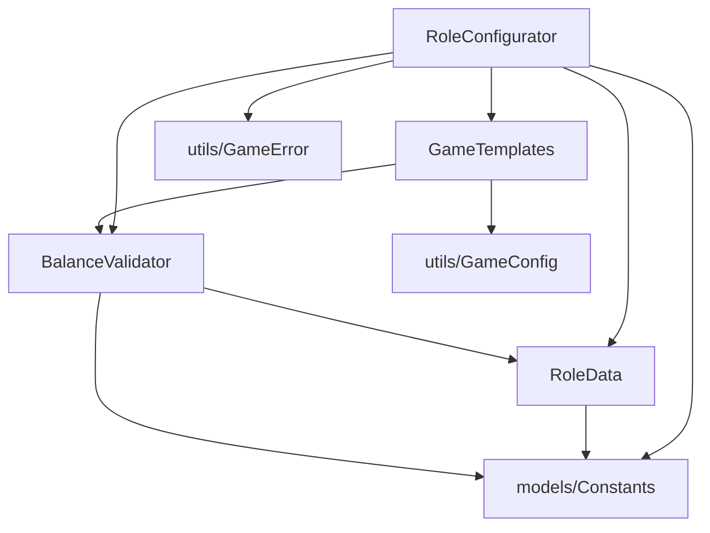

# utils/configurators - 配置器

## 概述

此目录包含游戏配置相关的工具类，负责角色组合的生成、验证和平衡性检查。

## 文件列表

| 文件名 | 导出 | 描述 | 主要依赖 |
|--------|------|------|----------|
| RoleConfigurator.js | RoleConfigurator | 角色配置器，生成角色组合 | GameTemplates, RoleData, BalanceValidator |
| GameTemplates.js | GameTemplates | 游戏模板管理 | GameConfig, BalanceValidator |
| RoleData.js | RoleData | 角色数据和属性 | Constants |
| BalanceValidator.js | BalanceValidator | 平衡验证器 | RoleData, Constants |

## 模块详情

### RoleConfigurator.js - 角色配置器

核心配置类，根据玩家人数生成平衡的角色配置：

```javascript
class RoleConfigurator {
  // 根据玩家数量生成角色组合
  static generate(playerCount) { ... }

  // 程序化生成配置（内部方法）
  static _generateProceduralConfig(playerCount) { ... }
}
```

### GameTemplates.js - 游戏模板

从 `modes.yaml` 加载预设模板：

```javascript
class GameTemplates {
  // 获取指定人数的标准模板
  static getTemplate(playerCount) { ... }

  // 获取所有支持的玩家人数
  static getAvailablePlayerCounts() { ... }

  // 获取指定人数的模板变种
  static getTemplateVariations(playerCount) { ... }

  // 随机获取一个配置（标准或变种）
  static getRandomTemplate(playerCount) { ... }

  // 获取最接近的模板（处理非标准人数）
  static getNearestTemplate(playerCount) { ... }

  // 获取模板元数据（名称、描述）
  static getTemplateMetadata(playerCount) { ... }
}
```

### RoleData.js - 角色数据

角色的基础数据和属性定义：

```javascript
class RoleData {
  // 获取角色权重
  static getWeight(roleName) { ... }

  // 获取角色阵营
  static getCamp(roleName) { ... }

  // 获取角色解锁所需最小人数
  static getUnlockCount(roleName) { ... }

  // 获取角色描述
  static getDescription(roleName) { ... }

  // 获取角色中文名
  static getRoleDisplayName(roleName) { ... }

  // 获取指定人数下可用的角色
  static getAvailableRoles(playerCount) { ... }

  // 获取指定阵营的所有角色
  static getRolesByCamp(camp) { ... }

  // 判断角色阵营
  static isWolf(roleName) { ... }
  static isGod(roleName) { ... }
  static isVillager(roleName) { ... }
}
```

### BalanceValidator.js - 平衡验证器

检查角色组合的平衡性：

```javascript
class BalanceValidator {
  // 验证配置是否平衡
  static validate(template) { ... }
  // => { isValid: boolean, reason: string, details: Object }

  // 计算平衡度评分 (0-100)
  static calculateBalanceScore(template) { ... }
}
```

## 平衡计算规则

平衡度基于角色权重计算：

| 角色 | 权重 | 说明 |
|------|------|------|
| 狼人 | -6 | 强势角色，负权重 |
| 村民 | +1 | 基础角色 |
| 预言家 | +4 | 强力信息角色 |
| 女巫 | +3 | 强力干预角色 |
| 猎人 | +2 | 中等战力角色 |
| 守卫 | +2 | 中等保护角色 |

**验证条件**：
- 阵营力量比（evilRatio）需在合理范围内
- 狼人比例（wolfRatio）需在 20%-35% 之间
- 特殊角色需满足解锁人数要求

## 依赖关系



## 使用示例

```javascript
import { RoleConfigurator } from './utils/configurators/RoleConfigurator.js'

// 根据人数自动生成角色
const roles = RoleConfigurator.generate(9)
// => ['WOLF', 'WOLF', 'WOLF', 'PROPHET', 'WITCH', 'HUNTER', 'VILLAGER', 'VILLAGER', 'VILLAGER']
```

## 配置文件

GameTemplates 读取 `config/config/modes.yaml` 中的游戏模板：

```yaml
presets:
  9:
    name: "9人标准预女猎"
    description: "3狼, 1预, 1女, 1猎, 3民"
    roles:
      WOLF: 3
      PROPHET: 1
      WITCH: 1
      HUNTER: 1
      VILLAGER: 3
  10:
    name: "10人标准预女猎守"
    description: "3狼, 1预, 1女, 1猎, 1守, 3民"
    roles:
      WOLF: 3
      PROPHET: 1
      WITCH: 1
      HUNTER: 1
      GUARD: 1
      VILLAGER: 3
```
